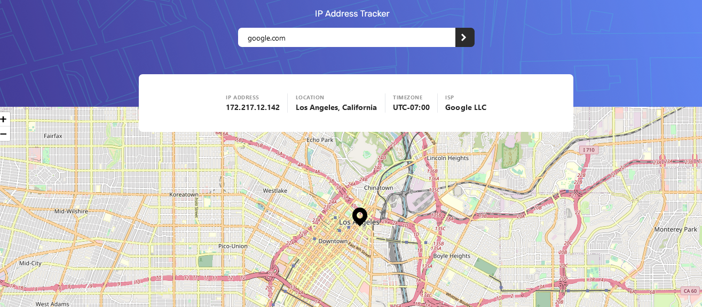

# Frontend Mentor - IP address tracker solution

This is a solution to the [IP address tracker challenge on Frontend Mentor](https://www.frontendmentor.io/challenges/ip-address-tracker-I8-0yYAH0). Frontend Mentor challenges help you improve your coding skills by building realistic projects.

## Table of contents

- [Overview](#overview)
  - [The challenge](#the-challenge)
  - [Screenshot](#screenshot)
  - [Links](#links)
- [My process](#my-process)
  - [Built with](#built-with)
  - [What I learned](#what-i-learned)
  - [Continued development](#continued-development)
  - [Useful resources](#useful-resources)
- [Author](#author)
- [Acknowledgments](#acknowledgments)

**Note: Delete this note and update the table of contents based on what sections you keep.**

## Overview

### The challenge

Users should be able to:

- View the optimal layout for each page depending on their device's screen size
- See hover states for all interactive elements on the page
- See their own IP address on the map on the initial page load
- Search for any IP addresses or domains and see the key information and location

### Screenshot

### Links

- Solution URL: [Click here](https://github.com/LivingHopeDev/ip-address-tracker)
- Live Site URL: [IPAddressTracker](https://main--dashing-figolla-916404.netlify.app/)

## My process

### Built with

- Semantic HTML5 markup
- CSS custom properties
- Flexbox
- CSS Grid
- Mobile-first workflow
- [React](https://reactjs.org/) - JS library
  -Tailwindcss

### What I learned

I learnt how make use of leafletjs and react-leaflet. learning how to work with map is amazing.

To see how you can add code snippets, see below:

### Useful resources

- [Example resource 1](https://react-leaflet.js.org/) - This helped me with using leaflet in react app.

## Author

- Frontend Mentor - [@yourusername](https://www.frontendmentor.io/profile/livingHopeDev)
- Twitter - [@yourusername](https://www.twitter.com/adewobiadetayo)

## Acknowledgments

I was able to get a good understanding of how the map work from Thomas Sankara (youtube).
